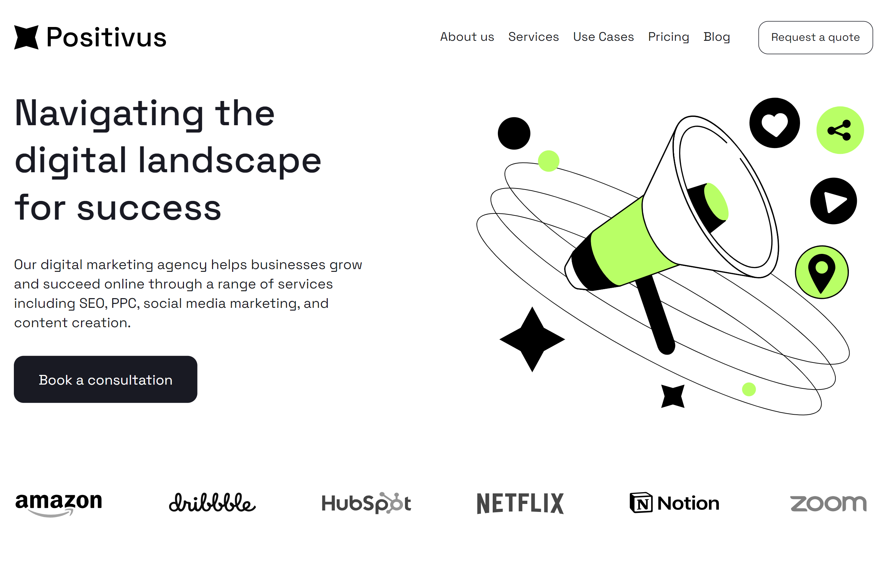

# Digital agency Positivus

[Ссылка на GitHub Pages](https://yaroslav-chertov.github.io/digital-agency-positivus/)

[Ссылка на макет в Figma](https://www.figma.com/file/iat2ibvjV50PpGlc9v0m9v/Positivus-Landing-Page-Design-(Community)-(Copy)?type=design&node-id=336%3A1596&mode=dev)

## Описание и функциональность

Работа представляет из себя прототип сайта для digital-агентства.



Функционал:

* Адаптивная верстка для экранов популярных размеров;
* Расширинный функционал Html и SCSS.

Технологии

* SCSS;
* Flexbox, Grid Layout;
* БЭМ;
* Подключение стороннего шрифта;

Выводы:
* Работая над эти проектом, получил понимание приемущества применения препроцесоора CSS. C его помощью можно создавать стили намного эффективнее и их проще обслуживать. А с помощью миксинов удалось группировать нужные стили и повторно использовать их в разных местах.
  
## Инструкция по установке

```
git clone https://github.com/Yaroslav-Chertov/digital-agency-positivus.git
```

Затем запустить локальный сервер.
